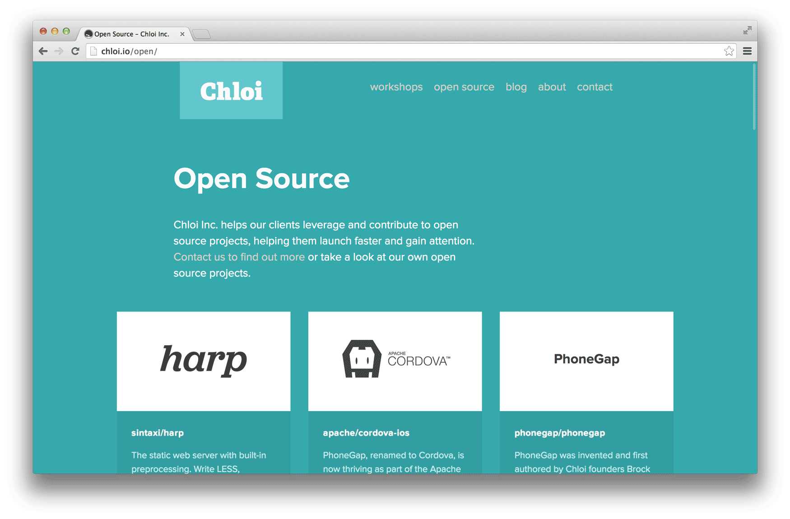

# chloi.io

Our website.

It’s built with ours and others’ open source projects, including:

- [Harp](http://github.com/sintaxi/harp)
- [Straight Up](https://github.com/kennethormandy/straight-up)
- [Normalize-OpenType.css](https://github.com/kennethormandy/normalize-opentype.css)
- [Figment](http://github.com/kennethormandy/figment)



## Getting started

To run the project locally, run the following commands:

```bash
# Install Harp
npm install -g harp

# Clone the repository
git clone https://github.com/chloi/chloi.io

# Serve the project folder with Harp
harp server chloi.io/

# Open your browser
open http://localhost:9000
```

## Deploying

Follow the [Running locally](#running-locally) instructions. You’ll need to be a collaborator on the project through Surge to deploy. Then:

```bash
# Compile to www/ and deploy
npm run deploy
```

## License

Copyright © 2012–2014 [Chloi Inc.](http://chloi.io)
